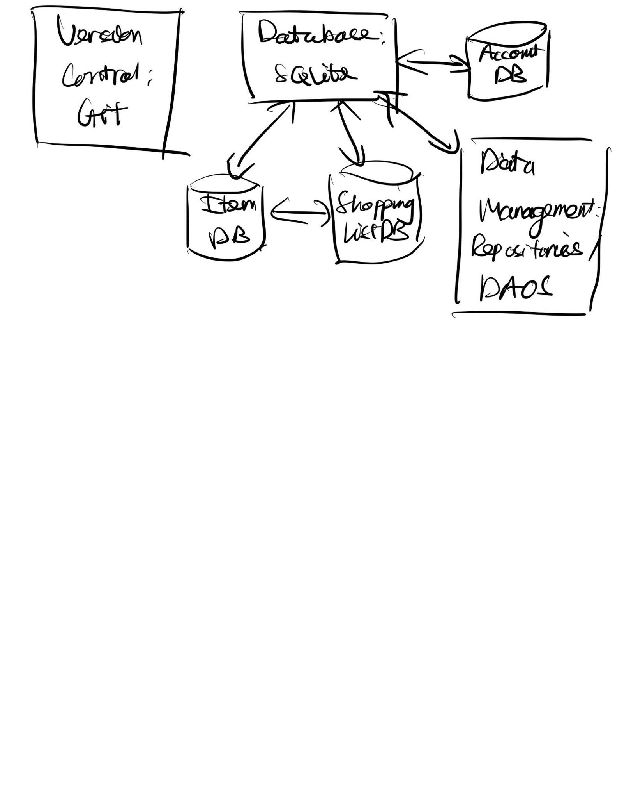

# Architecture

## A technology stack diagram.

### UI Layer: 
- Programming Language: Java
- Development Environment: Android Studio 
- UI Design: XML (Android Studio uses XML Design) 
- UI/UX Enhancements: ? 

### Business Layer: 
- Networking: Retrofit/Volley \
For making network requests to connect with remote servers or APIs.
- Data Serialization (Data Scraping): GSON/JACKSON \
For parsing and serializing JSON data when communicating with a server.
- Dependency Injection: Dagger/Koin \
Manages dependencies in the app, improving code maintainability.
- Authentication (if needed): Firebase Authentication or OAuth libraries \
For user accounts and authentication.
- App Logic and Functionality: Written in Java, business logic and functional components of the app
- Testing: 
    - JUnit: For unit testing.
    - Espresso: For UI testing.

### Data Layer: 
- Database:
    - SQLite: Local database for storing app data, including the shopping list items.
    - Item Database (storing items, prices, etc.) 
    - Shopping list Database (storing shopping list) 
    - Account Database 
- Version Control:
    - Git: Tracks changes in code and facilitates collaboration.
- Data Management:
    - Repositories/DAOs (Data Access Objects): Interact with the SQLite database to manage data.

### Diagram: 
 
 